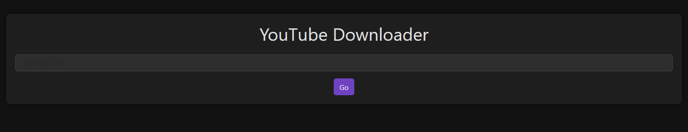
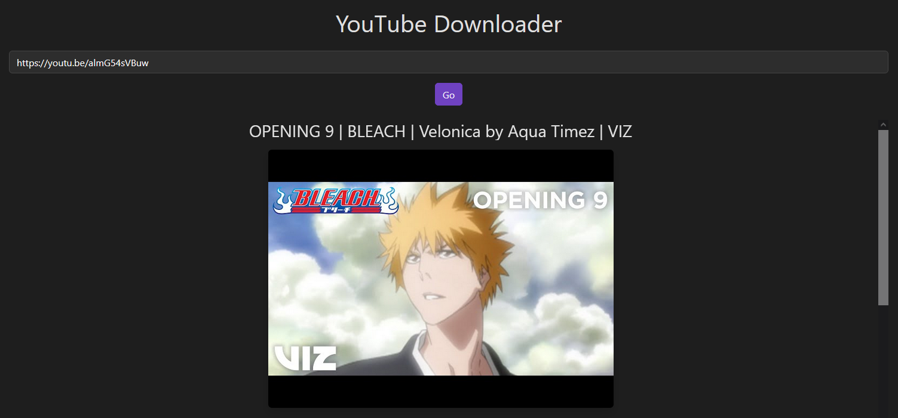
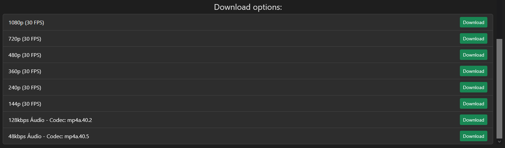

# YouTube Downloader



A simple and elegant YouTube video downloader built with **Flask**, **jQuery**, and **Bootstrap**. This application allows users to fetch video information and download YouTube videos in various formats and resolutions.

---

## Features

- 🎥 **Download Videos**: Choose from multiple resolutions and formats.
- 🎵 **Download Audio**: Extract and download audio-only streams.
- 🌙 **Dark/Light Mode**: Toggle between dark and light themes for better user experience.
- ⚡ **Fast and Responsive**: Built with modern web technologies for a seamless experience.
- 🖼️ **Video Previews**: View video thumbnails and details before downloading.

---

## Screenshots

### Video Info


### Download Options


---

## Installation
### Prerequisites
- Python 3.x
- Internet connection (for downloading videos)

You can run this application locally by following these steps:

1. Install the required packages:
   ```bash
   pip install -r requirements.txt # It is advised to use a virtual environment
   ```

2. Run the Flask application:
   ```bash
    python app.py
    ```